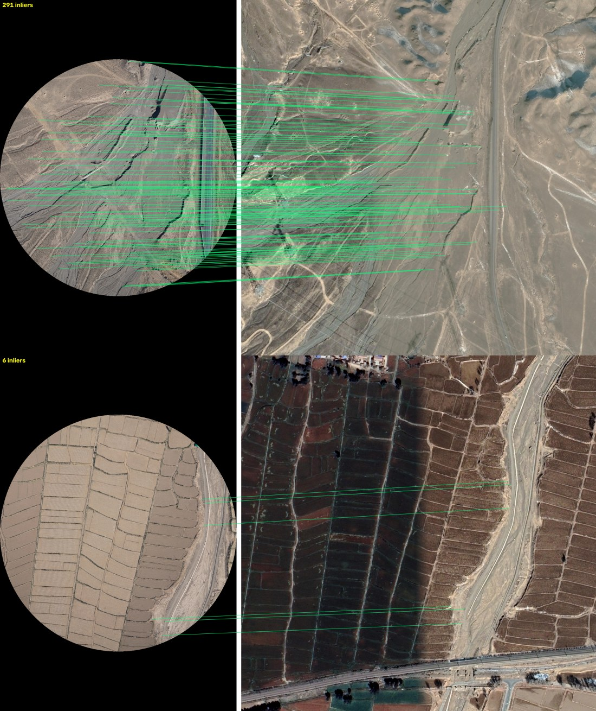
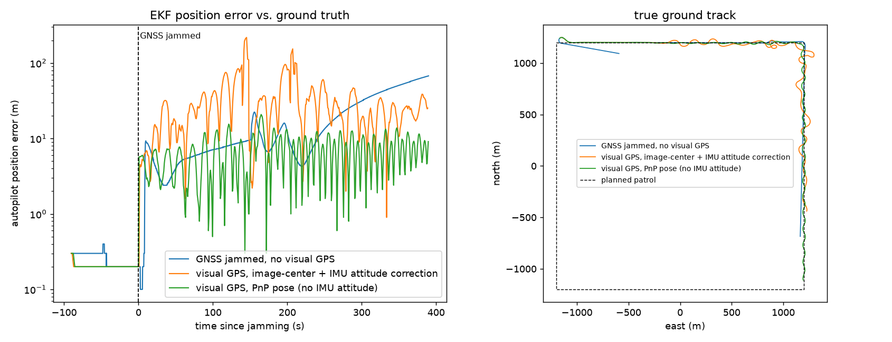
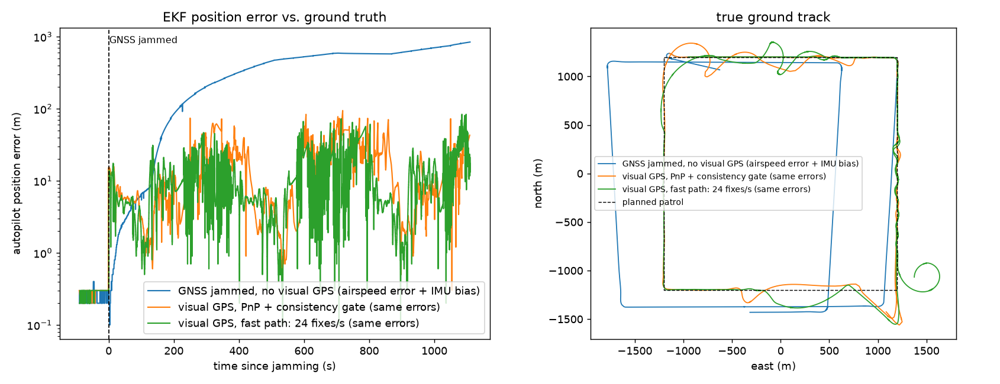
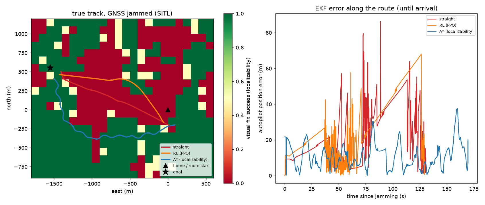

# GNSS-Denied Visual Navigation for Fixed-Wing UAVs

Localize a UAV **without GPS** by matching its downward camera against a satellite map, then feed the
position to the autopilot (ArduPilot) so the mission continues when GNSS is jammed.

> Status: **Sprint 1 done** (visual localization on real UAV imagery) · **Sprint 2 done** (closed loop in
> ArduPilot SITL + Gazebo) · **Sprint 3 in progress**: realistic simulation — the simulated camera sees real drone
> photos, with sensor errors: over 18.5 min of GNSS jamming the error stays **≤ 94 m** with visual GPS vs **840 m
> and growing** without it.


*Unseen test flight 11. Top: 291 consistent matches → confident fix. Bottom: season change between photo and
map (dry vs. ploughed fields), only 6 matches → the system reports "not confident" instead of a wrong position.*

## Pipeline

```
drone photo ──► north-up + metric scale ──► DINOv2 (fine-tuned) ──► top-10 map tiles ──► SuperPoint+LightGlue
              (compass heading, baro height)    global descriptor        FAISS search        + RANSAC similarity
                                                                                                    │
                                              lat/lon + confidence (#inliers) ◄─────────────────────┘
```

Only GNSS-free inputs are used at test time: the image, heading (compass/IMU) and height (barometer).
The whole satellite map of the flight area is searched (no position prior).

## Results — Sprint 1

Dataset: [UAV-VisLoc](https://github.com/IntelliSensing/UAV-VisLoc) (real fixed-wing/multirotor flights over 11
Chinese regions, 0.3 m satellite maps). **Split by region** so test areas are never seen in training:

| split | flights | images |
|---|---|---|
| train | 01, 02 (Changjiang) · 05 (Yunnan) · 08, 09 (Huzhou) · 10 (Huailai) | 4 304 |
| val (model selection) | 06 (Zhuxi, mountains) | 344 |
| **test** | 03, 04 (Taizhou) · 11 (Shandan, arid plateau) | **2 096** |

Flight 07 is excluded (30 images, degenerate map bounds).

Test results (2 096 queries, global search over each flight's map, 11k–24k tiles per map):

| method | median error | < 50 m | < 100 m | confident | confident & > 100 m off |
|---|---|---|---|---|---|
| DINOv2-B pretrained (top-1 tile) | 199 m | 18.2 % | 36.9 % | – | – |
| DINOv2-B fine-tuned (top-1 tile) | 39 m | 63.1 % | 87.4 % | – | – |
| pretrained + LightGlue refine | 30 m | 69.1 % | 75.3 % | 73.6 % | 2 |
| **fine-tuned + LightGlue refine** | **24 m** | **88.7 %** | **97.3 %** | **94.8 %** | **2 / 1 987** |

Per test flight (fine-tuned + LightGlue): 03 → 18.5 m median, 04 → 32.1 m, 11 → 27.2 m.
"Confident" = at least 25 RANSAC inliers. Latency on RTX 5090: retrieval < 1 ms/query, LightGlue refine ≈ 0.55 s/query (10 candidates, unoptimized).

Fine-tuning: last 4 DINOv2 blocks, symmetric InfoNCE, in-batch negatives from the same city with GT positions
≥ 150 m apart (consecutive frames overlap and would otherwise be false negatives), haze/blur/colour and
±5° heading-noise augmentation. 15 epochs ≈ 3 minutes on one GPU; best epoch chosen on the validation flight.

### Findings worth knowing
- **Label time lag.** Refined errors are biased ~15 m *along the flight direction* with ~0 cross-track bias:
  the GT GPS stamp lags the photo by ~1 s. A large part of the remaining error is label noise, not the model.
  Any correction will be fit on training flights only.
- **`height` is above sea level**, not above ground. We calibrate an *effective* focal length per flight
  (`scripts/calibrate_camera.py`), valid while terrain height is roughly constant along the flight.
- **Heading convention.** Rotating the photo by `-Phi1` makes it north-up on every flight (residual 1–8°),
  recovered from data rather than assumed.

## Results — Sprint 2: closed loop, GNSS jammed

[Demo video (docs/demo.mp4)](docs/demo.mp4): onboard nadir camera (left) and the satellite map with the true
track (white) and visual fixes (green), recorded in the simulator.

**Setup.** Gazebo Harmonic world whose ground is the flight-03 satellite map (4 × 4 km, a *test* region never
used in training), ArduPlane SITL flying a Zephyr with a nadir camera (1280×854, 52° HFOV) on a 2.4 km square
patrol at 400 m. The autopilot runs a real **EKF3** (the stock Gazebo config uses simulator-truth attitude, which
would make GPS loss meaningless). GPS1 is the simulated GNSS receiver; **GPS2 is our visual localizer**, sent as
MAVLink `GPS_INPUT`. 90 s after the visual node starts, GPS1 is switched off and the patrol continues for 6.5 min.
Ground truth comes from SITL's `SIMSTATE`.

| run (6.5 min after jamming) | EKF error median | p95 | max | at end | visual fix error |
|---|---|---|---|---|---|
| GNSS jammed, no visual GPS (dead reckoning) | 9.1 m | 58.9 m | 67.5 m | **67.5 m, growing** | – |
| visual GPS, image-center fix + IMU attitude correction | 25.3 m | 92.9 m | 218.2 m | 25.3 m | 20.4 m |
| **visual GPS, PnP pose (position + attitude from the image)** | **6.6 m** | **12.6 m** | **20.8 m** | **9.1 m** | **4.1 m** |



### What the closed loop taught us
1. **Attitude, not matching, was the bottleneck.** With a body-fixed camera the image center is not below the
   aircraft when it pitches or banks. Correcting this with the autopilot's attitude works while GPS is healthy,
   but without GPS the EKF attitude drifts by 1–3° — at 400 m that is 9–19 m of position error. Feeding the
   simulator's *true* attitude instead cut the visual fix error from 20.5 m to 4.5 m, which isolated the cause.
2. **…and it is a feedback loop.** Wrong attitude → biased visual fix → the EKF fuses it → attitude gets worse.
   With IMU-attitude correction the EKF error oscillates up to 218 m (orange track zig-zags around the route).
3. **PnP removes the dependency.** Hundreds of image↔map correspondences give a full camera pose (planar PnP,
   IPPE + LM refinement): position, height above ground and tilt — no IMU attitude needed. Offline on a recorded
   flight with a 2° pitch error injected into the IMU attitude, image-center correction degrades from 4.7 m to
   15.4 m median error, PnP stays at **4.3 m**; visual tilt error **0.06°**, visual height error **0.5 m**.
4. **Time is physical.** The simulator ran at ~1/3 real time under camera rendering + GPU load. Velocity and
   latency computed from the wall clock under-stated the speed 3×, so the EKF fused stale, slow fixes and kept the
   aircraft ~28 m behind. Using simulation timestamps (and projecting each fix forward by its latency) brought
   the EKF error from 27.9 m to 6.6 m median. On real hardware there is one clock, but the latency projection
   still matters: ~0.75 s of processing at 20 m/s is 15 m.
5. **Banked turns are skipped** (> 25° tilt): the oblique view matches poorly; the EKF coasts on the IMU.

### Honest limits of this simulation
- The ground texture *is* the reference map, so matching is easier than reality → addressed in Sprint 3
  (drone-photo ground).
- No wind and an idealized IMU, so dead reckoning drifts far less than on a real fixed-wing without GPS → Sprint 3
  adds an airspeed scale error as a wind proxy (true wind is not supported by ArduPilot's JSON backend).
- Flat terrain is assumed (planar PnP); fine for the plains here, not for mountains.

## Results — Sprint 3: a realistic simulation

### 18.5 minutes of GNSS jamming over real drone imagery



**What changed vs. Sprint 2** (where the simulated ground *was* the reference map):
- **Ground texture = real drone photos.** `sim/make_mosaic.py` registers 420 real UAV-VisLoc photos of flight 03
  (2018, haze, other season) to the map and blends them into an orthomosaic; 61 % of the 4 × 4 km world is covered,
  the rest falls back to the satellite map. The localizer still matches against the *Google satellite* map, so the
  real domain gap is back: ~50–150 inliers instead of ~500, and the visual fix error is analysed separately over
  drone-photo ground vs. satellite fallback (`sim/analyze_coverage.py`).
- **Airspeed sensor on** (every real fixed-wing has one; the stock Gazebo Zephyr disables it).
- **Sensor errors** (`sim/params/errors.parm`): ArduPilot's JSON/Gazebo backend has no wind support, and with a
  perfect airspeed sensor and no wind a GNSS-denied EKF dead-reckons almost perfectly (31.7 m in 6.5 min). A +6 %
  airspeed scale error plays the role of unknown wind (a persistent, unobservable speed error) plus small IMU biases.

| 18.5 min jammed, real-imagery world, sensor errors | EKF error median | p95 | max | at end |
|---|---|---|---|---|
| no visual GPS (dead reckoning) | 498 m | 758 m | 840 m | **840 m, growing** |
| visual GPS: PnP + consistency gate, position-only (1.0 fix/s, 0.9 s latency) | 10.6 m | 50.6 m | 94 m | 43 m |
| **same, fast path (24 fixes/s, 0.18 s latency)** | **6.3 m** | **28.8 m** | **84 m** | 17 m |

Visual fix error: **~11–12 m median over real drone photos** (p95 ~30 m, 72–80 % of frames accepted) vs. ~5 m over the
satellite fallback; ~0.15 % of sent fixes were > 50 m off. With the fast path the EKF error over drone-photo ground
is 12.2 m median (17.7 m before) and 4.7 m over the satellite fallback. Single run per configuration.

**Speed.** Profiling a 246 ms fix showed the time was not in the networks: re-reading the GeoTIFF for every candidate
(79 ms, far worse through WSL's /mnt/c) and re-running SuperPoint on the same map crops (57 ms). Pre-flight map
preparation (`gdnav/mapfeatures.py`: the area map in RAM + SuperPoint keypoints computed once, 13 s for 4.6 × 4.6 km)
and single-window tracking (one fp16 LightGlue call around the prior, no retrieval) give **33 ms per tracking fix
(7.2×) with unchanged accuracy** on 160 real-imagery frames (median 7.4 vs 7.0 m, p95 28.9 vs 32.2 m;
`scripts/compare_fast.py`); global relocalization 444 → 159 ms.

### What it took (each item was a failure first)
1. **Wrong-but-confident matches.** On real imagery 2.6 % of confident fixes were > 50 m off, and one triggered an
   EKF reset to a 250 m error. A **rule-based consistency gate** catches them because a wrong match rarely has a
   consistent pose: PnP height vs. barometer (AUC 0.88), PnP tilt vs. IMU tilt (AUC 0.97), plus a minimum match
   count. It rejected all 16 bad fixes of the run it was tuned on and let 1 of 393 through on a fresh run.
2. **The gate can lock itself out.** It compares against the EKF attitude, which drifts when no fix arrives; then
   it rejected *correct* fixes. **Degraded mode:** after 5 s without an accepted fix the tilt check is dropped and a
   stricter match count is required (barometric height still checked).
3. **Never lie about your accuracy.** Fixes were sent with a velocity from finite differences claimed at ±1 m/s;
   on real imagery that velocity was off by 10–50 m/s. The EKF used it to estimate **wind** (GPS velocity −
   airspeed), learned a fake wind, and when fixes paused it dead-reckoned with it: 2.7 km of divergence and a
   50° attitude error.
4. **ArduPilot keeps the last GPS velocity** when `GPS_INPUT` flags it as missing — after a tracking gap it fused a
   30 s-old velocity from before a turn. Final design: **position-only** visual GPS (`EK3_SRC1_VELXY 0`), latency
   projected with the EKF's own velocity, GPS week time driven by **simulation time** (used for jitter correction).
5. Result: no divergence in 18.5 min; attitude error ≤ 7.7° (it reached 40–50° in the failed variants).

### Localizability-aware route planning (A* vs. RL)

Visual localization is not equally good everywhere: rivers, uniform fields and parts of the drone-photo ground
fail. Planning a route that keeps the aircraft localizable was tested in three steps.

1. **Localizability map** (`scripts/localizability_map.py`): the Gazebo ground *is* the orthomosaic, so the camera
   view at any point can be synthesized from it (verified against real Gazebo frames) and fed to the real localizer
   — 1 296 cells of 100 m over the whole area in minutes. Checked against the 18.5-min closed-loop flight: where the
   map predicts < 25 % success the aircraft actually got good fixes 43 % of the time, where it predicts > 75 %, 89 %
   (AUC 0.67). A *satellite-only* proxy (keypoint density, texture) correlates weakly (r ≈ 0.3): what fails is the
   camera-vs-map appearance gap, which the map alone does not show → in practice this map comes from past flights.
2. **Planners** on a belief model (fix failures tied to places; uncertainty grows ~quadratically without fixes,
   calibrated on the dead-reckoning run): A* with cost = length × (1 + λ·(1 − success)) vs. a **PPO policy**
   (stable-baselines3, 7×7 local map + its current uncertainty as observation, 1.5 M steps, 2 min on CPU).
   On 100 random missions (≥ 2 km): straight max-uncertainty 32.6 m; A* 13.3 m at +3 % length, 10.0 m at +8 %;
   PPO 21.4 → 17.3 m at +0–2.5 % depending on its uncertainty weight. **A* dominates** on a static, fully known
   map (it is optimal there, and the policy only sees 700 m around it); RL's niche would be maps that are unknown
   or change in flight — not demonstrated here.
3. **Closed loop in SITL** (GNSS jammed at route start, sensor errors, one flight each):



| 1.8 km mission over a hard area | flight time | EKF error median | **max** | longest fix gap |
|---|---|---|---|---|
| straight | 131 s | 19.2 m | 86.4 m | 35 s |
| RL (PPO) | 129 s | 12.2 m | 68.1 m | 60 s |
| **A\* (λ = 3)** | 170 s (+30 %) | **9.6 m** | **37.5 m** | **9 s** |

The straight and RL routes show the dead-reckoning ramps (no fixes over the hard area); the A* detour keeps fixes
coming. Single flights per route: a demonstration, not a statistic.

### Learned confidence model: not better than the rules (negative result)
`scripts/build_conf_dataset.py` recorded 800 frames over the real-imagery world (exact SIMSTATE labels, GNSS-denied
attitude/baro noise injected) → 981 fixes with 15 features (match counts, inlier ratio, distinct-place runner-up,
retrieval similarity/margin, texture, PnP reprojection, height/tilt consistency). A gradient-boosted classifier +
quantile regressor (`scripts/train_conf_model.py`, spatial split west/east) was compared with the rule gate:

| at the rule gate's acceptance rate (89.5 %) | bad fixes (> 30 m) let through | p95 error of accepted |
|---|---|---|
| rule gate (3 hand-written checks) | 10 | 21.2 m |
| learned classifier (AUC 0.90) | 12 | 22.0 m |
| match count alone (AUC 0.88) | 11 | 21.4 m |

The bad fixes that pass are all 31–46 m, with *every* feature looking healthy (86–163 inliers, height within 4 m,
tilt within 4°, no competing place) and all over drone-photo ground — most likely local registration error of the
orthomosaic itself, i.e. of the test world, which no feature of the match can reveal. The learned q80 error is a
slightly better reported accuracy (80 %-target coverage 69 % vs. 61 % for `5 + 600 / inliers`), not enough to
justify a model in the loop. **The interpretable rule gate stays.**

### Does visual pose hold on real images?

PnP pose on **real** UAV-VisLoc photos (matched to the map around the labelled position, so only pose estimation
is tested), compared with the dataset's attitude labels (Omega/Kappa) and height. Plains flights only, because
`height` is above sea level: 03, 04 (Taizhou), 09 (Huzhou), ~80–110 images each.
(`scripts/eval_pose_real.py`, `scripts/selfcalib_real.py`)

| flight | height error (PnP vs label) | labelled tilt (median) | tilt error, raw | tilt error after mount calibration* |
|---|---|---|---|---|
| 03 | −0.9 m (0.5 %) | 1.45° | 1.3° / 1.8° | 1.4° / 1.3° |
| 04 | −0.6 m (0.5 %) | 2.77° | 1.3° / 1.7° | 1.3° / 1.0° |
| 09 | −0.8 m (0.5 %) | 1.73° | 1.3° / 2.0° | 1.1° / 1.2° |

*tilt errors are pitch / roll. *Constant mount offset estimated on the first 30 % of each flight (in a real
system: while GNSS is still healthy), evaluated on the remaining 70 %.*

- **Visual height is validated on real data** (0.5 %): usable to correct barometric drift without GNSS.
- **Single-image tilt is not**: ~1.2° on real images vs 0.06° in simulation. The camera intrinsics are unknown and,
  for a near-nadir camera, a small tilt and a principal-point offset produce almost the same image
  (120 px of principal-point shift ≈ 1.7° of tilt). Self-calibrating the camera with the ground as a planar target
  (Zhang's method) is **degenerate** for near-nadir views at constant height: focal length drifted from ~4 000 px
  to 5 000–10 500 px. 
- Consequence for the real system: visual tilt is about as uncertain as a GNSS-denied EKF attitude (1–3°), so it
  should be **fused over time** with the IMU (vision bounds the slow drift, the IMU keeps it smooth) rather than
  used frame by frame. The closed-loop PnP result of Sprint 2 relied on perfectly known simulated intrinsics.

## Reproduce

```bash
pip install -r requirements.txt
# data: UAV-VisLoc into ../data/UAV-VisLoc (or set VISLOC_ROOT); flight 09's four map tiles are merged into satellite09.tif
python scripts/calibrate_camera.py --flight 03          # per flight -> configs/camera_visloc03.json
python scripts/prepare.py 01,02,03,04,05,06,08,09,10,11 # north-up queries + metric map cache
bash   scripts/run_sprint1.sh                           # baseline, fine-tune, evaluation (+ LightGlue)
python scripts/visualize_match.py --flight 11 --idx 150 400
```

Simulator setup (WSL2 / Ubuntu 24.04): `sim/setup_root.sh` (Gazebo Harmonic + system packages, as root), then
`sim/setup_user.sh` (ArduPlane SITL + ardupilot_gazebo) and `sim/setup_ai.sh` (torch + matchers inside WSL).
`sim/smoke_sitl.sh` checks the MAVLink link.

```bash
python sim/make_world.py --zephyr-sdf <ardupilot_gazebo>/models/zephyr_with_ardupilot/model.sdf  # Windows/WSL
bash sim/run_experiment.sh control --no-send          # GNSS jammed, no visual GPS
bash sim/run_experiment.sh visual_pnp --pose pnp      # visual GPS with PnP pose
GUI=1 bash sim/run_experiment.sh visual_pnp --pose pnp  # same, with the Gazebo window (slower)
python sim/plot_runs.py control visual visual_pnp
python sim/eval_recording.py --rec outputs/sim_rec/run2 --pose pnp --pitch-bias 2   # offline ablation

# Sprint 3: realistic world (drone-photo ground) + sensor errors, one experiment per WSL session
python sim/make_mosaic.py && python sim/make_world.py --name visloc03_real --texture outputs/mosaic/visloc03_mosaic.png --zephyr-sdf <...>
WORLD=visloc03_real EXTRA_PARAMS=$PWD/sim/params/errors.parm bash sim/run_experiment.sh err_gated --pose pnp --duration 1200
WORLD=visloc03_real EXTRA_PARAMS=$PWD/sim/params/errors.parm bash sim/run_experiment.sh err_control --no-send --duration 1200
python sim/analyze_coverage.py err_gated
python sim/plot_runs.py gnss_jamming_realistic.png visloc03_real err_control err_gated
```

## Roadmap
- [x] Sprint 1 — visual localization on real imagery (retrieval + fine-tuning + LightGlue, confidence)
- [x] Sprint 2 — closed loop in ArduPlane SITL + Gazebo: visual GPS via `GPS_INPUT`, GNSS jamming, PnP visual pose
- [x] Sprint 3a — real-image pose validation, realistic sim (drone-photo ground, airspeed, sensor errors), consistency gate, robust EKF integration
- [x] Sprint 3b.1 — learned fix-confidence model vs. rule gate (negative result: rules kept)
- [x] Sprint 3b.2 — speed: pre-flight map features + single-window tracking (7× faster, EKF median 10.6 → 6.3 m)
- [x] Sprint 3b.3 — localizability map, A* vs RL (PPO) route planning, closed-loop route flights
- [ ] Next — target detection + GNSS-free target geolocation (synthetic data), oblique matching in turns, visual landing
- [ ] Sprint 4 — ONNX/TensorRT latency, demo video, model release
